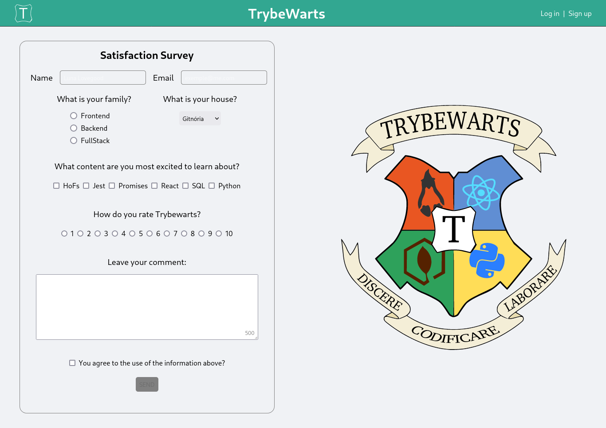

# TrybeWarts Project

## Link

[trybewarts.vercel](https://paulo-trybewarts.vercel.app/)

## About

This is my 7th project during my journey at Trybe!

In this project, I developed a feedback form page for the Trybewarts School of Magic, where students can submit their feedback about it. The theme of this project is based on J. K. Rowling's 'Harry Potter' series, as programming is the closest thing we can get to something magical!

## Repository Structure

- The `src` folder contains all the code

- The `src/assets` folder contains all the images used

## Implemented Functionalities

## Implementado Login e cadastro do usuário

  

    Implementado uma sessão de login e cadastro do usuário dentro do <code>header</code>
  
  

  - Existe os botões para o usuário fazer o login ou cadastrar-se, onde para cada uma das opções existe um card com seu formulário próprio

  - Existe o input de **email** dentro do formulário:
    - Adicionado o atributo `name` com o valor **email**
    - Adicionado o atributo `placeholder` com o valor **Email**

  - Existe o input de **senha** dentro do formulário:
    - Adicionado o atributo `name` com o valor **password**
    - Adicionado o atributo `placeholder` com o valor **Senha**

  - Existe o botão submit de ambos os forms (Login ou Cadastro):
    - No caso de login o botão só fica ativo caso o valor do input **email** tenha sido preenchido no formato `exemple@test.co` e o input **password** tenha **8 ou mais caracteres**

    - No caso do cadastro além de **email** e **password**, o input **name** também deve ser preenchido com pelo menos 3 caracteres e os termos de uso deve ser aceito para que o botão fique ativo

